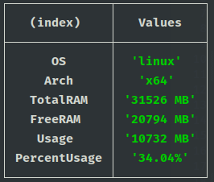

#RAM MEMORY USAGE

Pequeno e simples programinha para consultar a porcentagem de consumo de memória RAM do usuário.

Como usar:

 * clone o repositório ou baixe o projeto .zip
 * abra o terminal na pasta raíz e rode o comando ```npm start```
 * você vizualizará algo do tipo:

    
 * para encerrar a aperte ```ctrl + c```